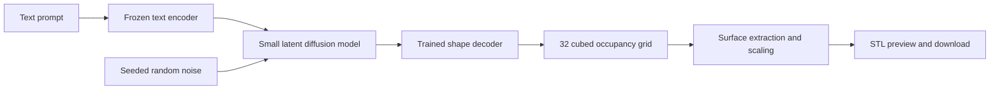

# STLModel

A local learning project that turns text prompts into downloadable STL meshes. The geometry generator is trained from scratch; a frozen pretrained text encoder supplies language embeddings. Early outputs are editable starting meshes, not guaranteed print-ready objects.

## Agreed implementation plan

### Architecture



- **Text encoder:** Frozen `sentence-transformers/all-MiniLM-L6-v2`, producing 384-dimensional embeddings. Cache embeddings to keep geometry training small.
- **Shape autoencoder:** A small 3D convolutional variational autoencoder trained from scratch on solid `32 x 32 x 32` occupancy grids, with a 256-dimensional latent representation.
- **Conditional generator:** Freeze the autoencoder, cache shape representations, and train a compact diffusion MLP conditioned on text and diffusion timestep.
- **STL exporter:** Decode occupancy probabilities, extract a triangle surface with marching cubes, inspect mesh integrity, scale to the requested longest dimension, and export STL.

This is a compact experimental adaptation of compression-plus-diffusion approaches, not a reproduction of a published model or a claim of equivalent quality. See [3D-LDM](https://arxiv.org/abs/2212.00842).

### Data and implementation order

Start with chairs and tables from [Text2Shape](https://svl.stanford.edu/projects/text2shape/), using paired descriptions and solid 32-resolution voxelizations. Verify applicable dataset terms and availability before downloading; [ShapeNet](https://huggingface.co/ShapeNet) access can require registration. Dataset permission is separate from the upstream source-code license.

1. **Data and export pipeline:** Load occupancy grids, ignore color, preserve orientation and proportions, and export known examples. Split by object ID so captions of the same object never cross training, validation, and test sets.
2. **Shape reconstruction:** Train the autoencoder using occupancy reconstruction loss and gradually introduced latent regularization. Inspect held-out reconstructions before training text generation.
3. **Text generation:** Cache shape and text embeddings, train conditional diffusion, and save resumable checkpoints with configuration, seeds, validation metrics, and elapsed time.
4. **Local interface:** Provide prompt, seed, longest dimension in millimeters, generation, 3D preview, and STL download in Gradio. Share generation logic between the UI and CLI.

Use Python and PyTorch. Keep preparation, training, generation, and mesh export separate. Keep datasets, generated assets, and checkpoints outside Git.

### Validation and acceptance

- Run a short GPU benchmark first, targeting peak allocated GPU memory below 5 GB on the GTX 1660 Ti (6 GB VRAM).
- Default to resumable training sessions capped at three hours. This is an experiment budget, not a promised time to useful model quality.
- Demonstrate tiny-sample overfitting, then evaluate held-out reconstruction with voxel overlap and visual inspection.
- Compare matched-seed prompt pairs such as chairs with/without armrests and evaluate against shuffled text conditioning.
- Inspect seed diversity and nearest training shapes for collapse or memorization.
- Reopen exported STL files, verify finite coordinates and requested dimensions, and report disconnected components and non-watertight surfaces. Fail clearly on empty geometry.
- Inspect representative exports in a slicer; successful export does not establish printability.

### Defaults and limits

- Local, single-user app; all geometry-model weights trained from scratch.
- First milestone: recognizable, editable chairs and tables. Broad object generation comes later.
- Conservative cleanup: report defects rather than silently deleting intended components.
- A 32-cubed grid limits thin structures and fine details. Helmet scars require relevant training data; text understanding alone cannot supply missing geometry knowledge.
- Increase resolution and dataset breadth only after reconstruction and conditioning tests demonstrate useful results.
- No pretrained geometry checkpoint is supplied. A working application is not an already-trained generator.

## Implementation and usage

### Setup (Windows / NVIDIA GPU)

Use Python 3.12 and an isolated environment. The tested GPU build is PyTorch 2.8.0 with CUDA 12.6; it runs on a GTX 1660 Ti. The wheel includes the CUDA runtime, so a separate CUDA toolkit is not required for this project.

```powershell
uv venv --python 3.12 .venv
uv pip install --python .venv/Scripts/python.exe torch==2.8.0 --index-url https://download.pytorch.org/whl/cu126
uv pip install --python .venv/Scripts/python.exe -e ".[dev]"
$projectPython = ".\.venv\Scripts\python.exe"
& $projectPython -m stlmodel --help
& $projectPython -m stlmodel benchmark --device cuda
```

For CPU-only operation, install a CPU PyTorch wheel instead and use `--device cpu`. `auto` selects CUDA when available. Training uses float32; mixed precision is deliberately not required. Python 3.14 is not the tested environment for this project.

`requirements-windows.lock` records the exact environment used for verification. To reproduce it in an empty Python 3.12 environment, install that file before installing this package:

```powershell
uv pip install --python .venv/Scripts/python.exe -r requirements-windows.lock --extra-index-url https://download.pytorch.org/whl/cu126
uv pip install --python .venv/Scripts/python.exe -e . --no-deps
```

### Data preparation

Download the caption CSV and **solid 32-resolution** NRRD archive from the Text2Shape project after reviewing the dataset terms, and extract the archive under `data/raw/voxels`. The importer does not download data, accept license terms, or silently skip missing/broken examples.

```powershell
& $projectPython -m stlmodel prepare --captions data/raw/captions.tablechair.csv --voxels data/raw/voxels --out data/prepared
```

The CSV must contain `modelId`, `description`, and `category`; `model_id`/`object_id` and `caption`/`text` are accepted aliases. Multiple captions are grouped under one object ID. File discovery supports `<modelId>.nrrd` and NRRD files inside a `<modelId>` directory. Ambiguous matches fail explicitly. An optional `voxel_path` column specifies a path relative to the CSV. Local binary `.npy` arrays and `.npz` files with an `occupancy` key are also supported.

NRRD alpha defines occupancy, so opaque black voxels remain geometry and transparent colored voxels do not. Color is discarded. Input must already be 32-cubed; there is no implicit resampling or independent axis stretching. Source grids are treated as XYZ with Y up; export rotates them to Z up. Check orientation on real imported examples before a long run.

Preparation creates compressed occupancy files and `manifest.json`, with object IDs, captions, categories, file hashes, and deterministic category-stratified splits (approximately 80/10/10; at least one validation/test object per category). At least three objects per category are required. A nonempty output directory is rejected to prevent accidental dataset replacement. `--limit-per-category 100` prepares a smaller pilot dataset.

For a download-free engineering fixture:

```powershell
& $projectPython -m stlmodel fixture --out data/fixture
```

This creates simple procedural chairs and tables. It is not Text2Shape and is not evidence of generalization to real objects.

### Train and inspect the autoencoder

```powershell
& $projectPython -m stlmodel train-vae --manifest data/prepared/manifest.json --out runs/vae --device cuda
& $projectPython -m stlmodel reconstruct --manifest data/prepared/manifest.json --vae runs/vae/best.pt --out outputs/reconstructions
& $projectPython -m stlmodel evaluate --checkpoint runs/vae/best.pt --source data/prepared/manifest.json --split test
```

The autoencoder uses three strided 3D convolution blocks (16/32/64 channels), GroupNorm, and a mirrored decoder. Loss combines binary cross entropy and soft Dice with a KL weight ramping from zero to 0.001 over 1,000 steps. Defaults: batch 8, AdamW learning rate 0.0002, latent size 256, 100 epochs, and a three-hour session budget. Validation reports voxel intersection-over-union (IoU) and binary cross entropy. Test data never selects a checkpoint.

For a tiny overfit check, use a **new run directory**, `--limit 2 --batch-size 2 --epochs 300 --max-steps 200`. This only restricts training; validation still uses held-out objects. Reconstruct with `--split train --count 2` to inspect the learned examples. A successful tiny overfit is a debugging milestone, not validation of model quality.

Each run saves `last.pt`, `best.pt`, `config.json`, `metrics.jsonl`, and `summary.json`. `last.pt` includes optimizer state, RNG state, epoch/batch cursor, cumulative steps, source fingerprint, and elapsed training time. `best.pt` selects highest validation IoU for the VAE and lowest validation noise MSE for diffusion. Checkpoints are also saved every 100 steps. Final validation/checkpoint writing can extend slightly beyond the time budget. Ctrl+C attempts to save the current state; resume from the last completed checkpoint after a hard termination.

```powershell
& $projectPython -m stlmodel train-vae --manifest data/prepared/manifest.json --out runs/vae --resume runs/vae/last.pt --epochs 200 --max-hours 3
```

Resume inherits saved settings unless explicitly overridden. Seed, batch size, learning rate, data, and architecture must match. `--max-steps` is a total step limit including prior sessions; `--max-hours` is a fresh per-session budget. Exact CPU continuation is tested; different devices/library versions may introduce numerical differences.

### Cache embeddings and train text conditioning

After reviewing the reconstructions, choose an autoencoder checkpoint and keep that exact file unchanged:

```powershell
& $projectPython -m stlmodel cache --manifest data/prepared/manifest.json --vae runs/vae/best.pt --out data/embeddings.pt
& $projectPython -m stlmodel train-diffusion --cache data/embeddings.pt --out runs/diffusion --device cuda
& $projectPython -m stlmodel evaluate --checkpoint runs/diffusion/best.pt --source data/embeddings.pt --split test --out outputs/diffusion-evaluation.json
```

The first cache operation downloads MiniLM into `.cache/sentence-transformers`. Subsequent operations use cached weights offline when available. Text embeddings are normalized, and the resolved model revision is recorded. VAE posterior means are standardized using **training-object statistics only**; captions reuse their object's representation. Neither pretrained component is updated during diffusion training.

The diffusion network has four residual width-512 MLP blocks, sinusoidal timestep features, a 200-step cosine noise schedule, and noise-prediction MSE. Default batch size is 64. Inference uses 50 deterministic DDIM steps. Validation compares correct versus shuffled text embeddings with identical sampled noise and timesteps; a positive conditioning gap is a useful diagnostic, not proof of correct attribute control. Sparse or visually irrelevant captions can limit learning.

Changing the autoencoder requires rebuilding the embedding cache and retraining diffusion. Inference rejects mismatched autoencoder/diffusion pairs instead of silently producing incorrect outputs.

### Generate, compare, and open the local interface

```powershell
& $projectPython -m stlmodel generate --vae runs/vae/best.pt --diffusion runs/diffusion/best.pt --prompt "a chair with armrests" --seed 42 --size-mm 100 --out outputs/chair.stl
& $projectPython -m stlmodel compare --vae runs/vae/best.pt --diffusion runs/diffusion/best.pt --manifest data/prepared/manifest.json --prompt "a chair with armrests" --prompt "a chair without armrests" --out outputs/comparison
& $projectPython -m stlmodel serve --vae runs/vae/best.pt --diffusion runs/diffusion/best.pt
```

Open **http://127.0.0.1:7860** after the server starts. The application listens only on localhost, does not create a public sharing link, and runs one generation at a time. It provides prompt, seed, size, preview, and download. Missing checkpoints are reported; the UI never substitutes random weights. Failed generations clear any previous download/preview. Generated files remain under `outputs/` until you remove them.

Generation writes STL plus `.mesh.json` and `.generation.json` sidecars documenting dimensions, defects, prompt, seed, sampling settings, and model fingerprints. STL is unitless; **interpret its coordinate values as millimeters in the slicer**. The longest dimension is scaled uniformly and the lowest point is placed at Z=0. Disconnected components are retained. Boundary-touching geometry is capped and flagged. Thickness, supports, wearable fit, and printability are not automatically solved.

`compare` exports matched prompt/seed samples and reports pairwise voxel IoU and nearest-training-shape IoU. These help inspect prompt sensitivity, diversity, and memorization; visual review remains necessary. To export a known grid without a trained model, use `export --voxel <file.npz> --out outputs/known.stl`.

### Tests and implementation layout

```powershell
& $projectPython -m pytest -q
.\.venv\Scripts\ruff.exe check src tests
.\.venv\Scripts\ruff.exe format --check src tests
```

- `src/stlmodel/data.py`: import, procedural fixtures, object-level splits, and integrity checks.
- `models.py` and `training.py`: VAE, diffusion, benchmark, training, resumption, and held-out metrics.
- `text.py` and `pipeline.py`: frozen text encoder, embedding cache, reconstruction, shared generation, and comparisons.
- `mesh.py`: surface extraction, conservative checks, scaling, and STL export.
- `cli.py` and `ui.py`: command-line workflows and local Gradio interface.
- `tests/`: data leakage, NRRD alpha, mesh integrity, exact resume, model pairing, deterministic inference, and interface behavior.

The tests use an explicitly injected offline text-encoder double where appropriate. Production generation always uses the real pretrained encoder. Synthetic checks do not establish research-data model quality.

### Verification performed — updated October 2, 2026

- Automated tests cover data and mesh behavior, exact CPU checkpoint continuation, both model stages, and application routes/callbacks. Lint and formatting checks pass.
- GTX 1660 Ti benchmark: batch 8, 10 timed synthetic VAE steps, approximately **0.0096 seconds/step** and **0.083 GiB peak PyTorch-allocated memory**. This excludes data loading, validation, CUDA context memory, and other GPU processes.
- The VAE trained on all **20 procedural training shapes** for **119.094 seconds**. Its selected checkpoint reached **0.891406 validation IoU** and **0.948203 test IoU**, compared with about 0.300 held-out IoU in the earlier two-object smoke run. Both validation reconstructions reopened as watertight, single-component meshes, though the chair loses armrests and the table has distorted edges.
- Diffusion initially trained for **166.204 seconds**, then resumed for **3,600.219 seconds (one additional hour)** on the GTX 1660 Ti. The extension added **86,876 steps**, reaching **89,876 total**. Its validation-selected checkpoint is step **5,542**; subsequent training overfit the fixture. The VAE, cached embeddings, architecture, learning rate, and splits remained fixed.
- The exact prompt **`A chair with a tall back and armrests`** and three chair/table controls were tested with seeds **42, 43, and 44**. All 36 before/selected/final STL exports reopened with finite coordinates, watertight surfaces, and a 100 mm longest dimension. They remain severely fragmented. The selected extended checkpoint has **37–174 disconnected components** across its 12 samples; the final full-hour state has **9–123**, with some clearer category differences but broken geometry. Tall/short-back control is not supported by this fixture's captions.
- No Text2Shape training run has been performed. No browser was connected for visual UI inspection, and no slicer/physical-print validation was performed. Local application routes and callbacks were tested programmatically.

The current diffusion metrics are:

| Checkpoint | Validation noise MSE | Validation conditioning gap | Test noise MSE | Test conditioning gap |
| --- | ---: | ---: | ---: | ---: |
| Original best, step 2,870 | 0.225077 | 0.003874 | 0.133528 | 0.005670 |
| Extended best, step 5,542 | **0.203372** | **0.009242** | **0.102985** | **0.012628** |
| Full-hour final state, step 89,876 | 1.245852 | 0.328311 | 0.540591 | 0.208712 |

The gap is shuffled-text MSE minus correct-text MSE. A larger gap alone does not establish better prompt following: the final state has much worse held-out error. There are only two validation and two test objects, evaluated with fixed sampled noise/timesteps. Checkpoint selection used validation only.

See the [one-hour extension report](experiments/procedural-extended-v1/report.md) for actual timings, metrics, defects, and matched-seed previews: [before](experiments/procedural-extended-v1/before/preview-front.png), [selected best](experiments/procedural-extended-v1/after/preview-front.png), and [full-hour final state](experiments/procedural-extended-v1/last/preview-front.png). The [initial full-fixture report](experiments/procedural-v1/report.md) remains available as the baseline.

To try the selected extended checkpoint on the machine with the local weights:

```powershell
.\.venv\Scripts\python.exe -m stlmodel serve --vae runs/procedural-vae-v1/best.pt --diffusion runs/procedural-diffusion-extended-v1/best.pt --device cuda
```

Open **http://127.0.0.1:7860**. To try the final full-hour state, replace the diffusion path with `runs/procedural-diffusion-extended-v1/last.pt`; its partially improved visual category separation comes with substantially worse held-out metrics. Geometry from both checkpoints remains defective.

The ignored datasets, checkpoints, and STL binaries remain local; a GitHub clone alone does not include the trained weights. These are small procedural engineering experiments, not a useful general-purpose model or evidence of Text2Shape performance.

First Run

Prompt: **`A chair with a tall back and armrests`**. This screenshot uses the original checkpoint, before the one-hour extension.


Second Run

Same Prompt:


